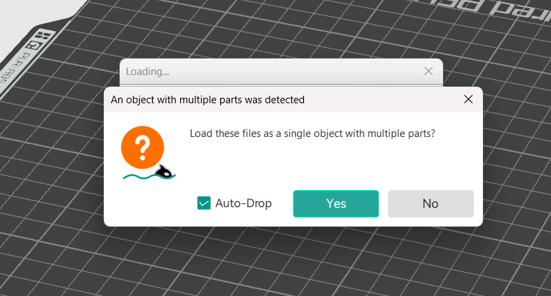

# Model import steps

Due to the presence of modelled-in supports, all the components under the folder `/import_together` should be imported **first** as a **single object with multiple parts** (click yes when prompted).

Then, import all other components as separate bodies.

Duplicate components to match the number in the file name.

# Slicer settings

Leave parameters as default:

| Param        | Value |
|--------------|-------|
| Layer height | 0.2mm |
| Wall loops   | 2     |
| Infill       | 15%   |
| Brim         | None  |
| Supports     | None  |

>![important] Important
>Turn supports off! The models are printable without supports.